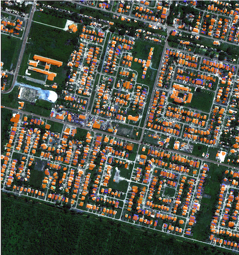

# Raster Vision Building Classification for IDB                                         {:height="50%" width="50%"}

## Description and Context
This repo contains code for running a [Raster Vision](https://github.com/azavea/raster-vision) experiment to train a model to segment buildings in three cities in Latin America:
* Georgetown, Guyana
* Paramaribo, Suriname
* Belice, Belize

The experiment analyzes the imagery, generates training chips, trains a model, make predictions (classifications), evaluates the predictions, and produces a prediction package which can be used to make predictions on new imagery. Training the model in a reasonable amount of time (a day as opposed to a month) requires a machine with a high-end NVIDIA GPU. It's possible to rent one in the cloud using the instructions for using AWS Batch. Below is an example of predictions over Georgetown, with predicted building pixels colored orange.



## Installation Guide

### Docker setup

First, install [Docker](https://docs.docker.com/install/) (preferably version 18 or above). These instructions assume a Unix-based environment; however, it should also be possible to run the Docker container in Mac or Windows environments.

This experiment was tested with [Raster Vision commit 9f38cc9](https://github.com/azavea/raster-vision/tree/9f38cc98af724c168f69e86b5fa1ad2ebe65071c). The corresponding Docker images are:
* `quay.io/raster-vision/cpu-9f38cc9`
* `quay.io/raster-vision/gpu-9f38cc9`

To use this with a more recent commit/version of Raster Vision it may be necessary to update the experiment configuration accordingly.

### Clone repo and download data

To get the scripts, source files, and data needed to run the experiment, clone this repo and then retrieve the data bundle.

TODO insert location of data bundle

Unzip the data bundle on the local filesystem to run the experiment locally. To run the experiment on AWS, unzip the dataset and upload it to an S3 bucket. The expected layout of this data bundle is
```
├── input
│   ├── belice
│   │   ├── aois
│   │   ├── imagery
│   │   ├── test-aois
│   │   └── train-aois
│   ├── georgetown
│   │   ├── aois
│   │   ├── imagery
│   │   ├── test-aois
│   │   └── train-aois
│   ├── paramaribo
│   │   ├── aois
│   │   ├── imagery
│   │   ├── test-aois
│   │   └── train-aois
│   └── vector-tiles
│       ├── belize.mbtiles.gz
│       ├── guyana.mbtiles.gz
│       └── suriname.mbtiles.gz
├── predictions
│   └── command-config.json
└── results
    ├── belice
    │   ├── belice-1-polygons.geojson
    │   ├── belice.tif
    │   └── screenshots
    ├── georgetown
    │   ├── georgetown-1-polygons.geojson
    │   ├── georgetown.tif
    │   └── screenshots
    ├── paramaribo
    │   ├── paramaribo-1-polygons.geojson
    │   ├── paramaribo.tif
    │   └── screenshots
    └── predict-package
        ├── georgetown_sample.tif
        ├── out_sample.tif
        └── predict_package.zip
```
The input directory contains everything necessary for running the experiment. For each city there is imagery and a set of training and test AOIs in GeoJSON format. There are also vector tiles for each country which are used for extracting labels. The results directory has predictions (GeoTIFF and GeoJSON) and screenshots for each city, and the prediction package. Set the `IDB_DATA_DIR` environment variable to point to the local data bundle using

```shell
> export IDB_DATA_DIR=<data bundle dir>
```

Before running experiments on AWS, or changing the layout of the data bundle, update the constants pointing to the data and RV output in [idb/experiment.py#L7-14](idb/experiment.py#L7-14) Note that the local variables (`local_rv_root` and `local_data_root`) should be prefixed with `/opt/data` since that is the directory in the Docker container that the `IDB_DATA_DIR` is mounted to. There is no need to update the local variables if the layout of the data bundle has not changed.

## Users's Guide

### Run the Docker console

Raster Vision commands need to be run from inside the Raster Vision Docker container, which can be accessed using:

```shell
> scripts/console
```

This will mount the following directories from the local filesystem into the container:
- `${IDB_DATA_DIR}` -> `/opt/data`
- `idb` -> `/opt/src/idb`

### Run experiment locally

The experiment in this repo trains a Mobilenet DeepLab model (pretrained on Pascal VOC) on small training AOIs over three large ~50k x ~50k scenes for 150k steps with a batch size of 8. The labels come from Open Street Map vector tiles. The predictions cover the entire scenes; therefore, the predictions over the training AOIs should be ignored. The evaluation metrics are computed using labels from held-out validation AOIs.

The commands to run an experiment must be invoked inside the Docker console, ie. after running `./scripts/console`. Before running a full experiment, it is a good idea to run a small test experiment to check that things are setup correctly using:
```shell
> rastervision run local -e idb.experiment -a test True
```
The main thing to check here is that it didn't crash. The model will not be not be useful since it was only trained for one step.

### Run experiment on a local GPU

To run Raster Vision on a local GPU, run the console with the `--gpu` flag. This will use the GPU version of the container and the `nvidia` Docker runtime. A full experiment can then be run with:
```shell
> rastervision run local -e idb.experiment
```

### Run experiment on an AWS GPU

To run an experiment on AWS, setup a Raster Vision Batch stack on your AWS account by following the instructions in the [Raster Vision AWS repository](https://github.com/azavea/raster-vision-aws). Using the names of the GPU and CPU Batch job definition and job queue that were created (which can be seen in the Batch console), set the appropriate configuration in your Raster Vision profile in `$HOME/.rastervision/default` which should contain:

```ini
[AWS_BATCH]
job_queue=<gpu job queue>
job_definition=<gpu job definition>
cpu_job_queue=<cpu job queue>
cpu_job_definition=<cpu job definition>
```

When running `./scripts/console`, set the `AWS_PROFILE` environment variable to the desired [profile](https://docs.aws.amazon.com/cli/latest/userguide/cli-configure-profiles.html), and use the `--aws` flag which will forward your AWS credentials and profile.

To run a full experiment remotely on AWS use:
```shell
> rastervision run aws_batch -e idb.experiment -a remote True
```
On a P3.2xlarge instance, this should take about a day.

### Viewing Tensorboard

During training, results can be monitored using Tensorboard at either `localhost:6006/` if running locally, or `<public_dns>:6006` if running
on AWS, where `<public_dns>` is the public DNS of the EC2 instance that is running the training job. To forward these ports to your localhost, run the console with the `--tensorboard` flag.

### Inspect output

The output of the experiment will be in `local_rv_root` or `remote_rv_root` (the variables set [here](idb/experiment.py#L7-14)) depending on whether it was run locally or remotely. The layout of the output directory is documented [here](https://docs.rastervision.io/en/0.8/quickstart.html#seeing-results). The `eval.json` file generated by the `eval` command that is part of the experiment should contain metrics similar to those in [sample-eval.json](sample-eval.json), with a building F1 score around 0.68.

### Make predictions on new imagery

The bundle command that was run as part of the experiment generates a *prediction package* which can be used to make predictions on new imagery. To make predictions using a sample image and the prediction package that comes with the data bundle use:

```shell
> rastervision predict /opt/data/results/predict-package/predict_package.zip /opt/data/results/predict-package/georgetown_sample.tif /opt/data/output.tif
```

The predictions, visualized in QGIS can be seen at the top of this file. Note that the `predict` command does not generate polygon output, only rasters. The polygon output can only be produced at the moment by the predict stage when running an experiment.

### Customizing the experiment

The experiment in this repo is configured to work with a specific set of scenes, but these can be modified by editing [scenes-config.json](scenes-config.json) and the `splits` variable in [idb/experiment.py#L74-87](idb/experiment.py#L74-87). To find the training and validation AOIs, we viewed imagery along with an OSM basemap in QGIS and then created polygons for well-labeled areas. If there are no well-labeled areas, you may need to contribute annotations to OSM, or choose a different city. The vector tile `.mbtiles` files included with the data bundle and used in this experiment were downloaded from [OSM QA Tiles Country Extracts](https://osmlab.github.io/osm-qa-tiles/country.html). Since these files can be very large, it is advisable to create a smaller extract focused on specific city using a tool like [Osmium](https://osmcode.org/osmium-tool/).

For more general customization of the experiment, see the [Raster Vision experiment config docs](https://docs.rastervision.io/en/0.8/experiments.html).

### Note on problematic GeoTIFFs

Raster Vision considers zero valued pixels to be NODATA and skips over them when making predictions. Unfortunately, the GeoTIFF for Belice that was provided by IDB has a problem. The parts of the scene that were not captured by the satellite that appear black when viewed in QGIS (that ought to have NODATA values) contain very low values (0-6) for unknown reasons. Because of this, Raster Vision makes many false positive predictions over these regions.

To get around this problem, there is a script at [idb/nodata_transform.py](idb/nodata_transform.py) which generates a new GeoTIFF where values below a minimum are set to zero. The experiment in this repo uses the fixed version of the GeoTIFF. When running an experiment on new imagery, if there are false positives over what looks like a NODATA part of the scene, this may be the problem, and using the `nodata_transform` script may help. For example, the Belice file was corrected using

```
python -m idb.nodata_transform 10 /opt/data/input/belice/imagery/belice.tif \
    /opt/data/input/belice/imagery/new_belice.tif
```

## Authors

[Lewis Fishgold](https://github.com/lewfish) @ [Azavea](https://www.azavea.com/)

## License

The Documentation of Support and Use of the software is licensed under Creative Commons IGO 3.0 Attribution-NonCommercial-NoDerivative (CC-IGO 3.0 BY-NC-ND)

The codebase of this repo uses the [AM-331-A3 Software License](LICENSE.md).

## Credits

This application uses Open Source components. You can find the source code of these components along with license information below. We acknowledge and are grateful to these developers for their contributions to open source.

Project: [Raster Vision](https://rastervision.io/)
Source Code: https://github.com/azavea/raster-vision
License: Apache 2.0

Project: [Rasterio](https://github.com/mapbox/rasterio)
Source Code: https://github.com/mapbox/rasterio
License: [Mapbox](https://github.com/mapbox/rasterio/blob/master/LICENSE.txt)

Project: [Numpy](http://www.numpy.org/)
Source Code: https://github.com/numpy/numpy
License: [Numpy](https://github.com/numpy/numpy/blob/master/LICENSE.txt)

Project: [Click](https://palletsprojects.com/p/click/)
Source Code: https://github.com/pallets/click
License: [Click](https://github.com/pallets/click/blob/master/LICENSE.rst)
